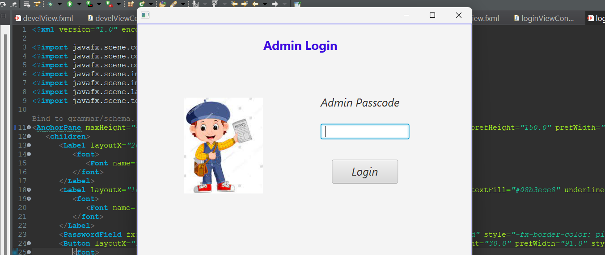

## Login Page

The **Login Page** serves as the entry point for administrators to access the Newspaper Automation System. This secure interface requires users to input their password for authentication, ensuring that only authorized personnel can manage the system's content and settings. The design prioritizes user experience, featuring a clean layout that facilitates easy navigation while maintaining a strong emphasis on security.

Upon entering their password, administrators can efficiently access the system's functionalities, enabling them to oversee operations and make necessary updates. The streamlined login process ensures that administrators can focus on managing tasks effectively and securely, allowing for a smooth transition into the main features of the application.
