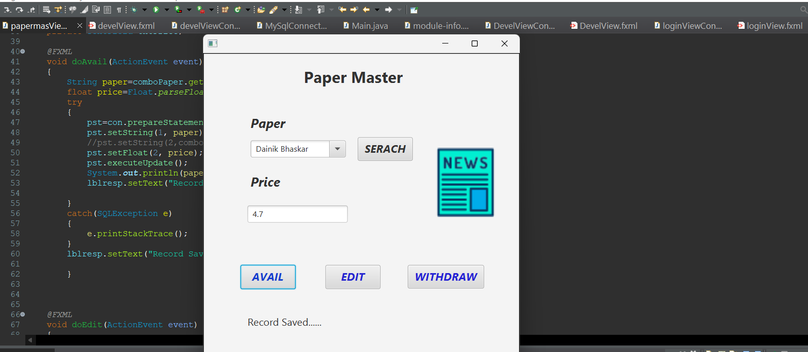

## Paper Master

The **Paper Master** feature provides administrators with a comprehensive interface to manage and search for various papers within the Newspaper Automation System. Using the dropdown menu, admins can easily select a specific paper to view its details, including availability and corresponding pricing information. This streamlined process allows for efficient paper management, ensuring that administrators can quickly access necessary information.

{: width=350px}

The Paper Master interface includes three key action buttons: **Withdraw**, **Edit**, and **Check Price**. 
- **Withdraw**: This button allows administrators to remove a selected paper from the system, ensuring that outdated or unavailable papers are no longer accessible.
- **Edit**: Administrators can use this button to modify details about the paper, including its title, description, and pricing, to keep the database up-to-date.
- **Check Price**: This function provides instant access to the current pricing of the selected paper, helping administrators make informed decisions regarding inventory and sales.

Overall, the Paper Master feature is designed to enhance the efficiency of paper management, making it easier for administrators to maintain an organized and updated catalog of available papers.
