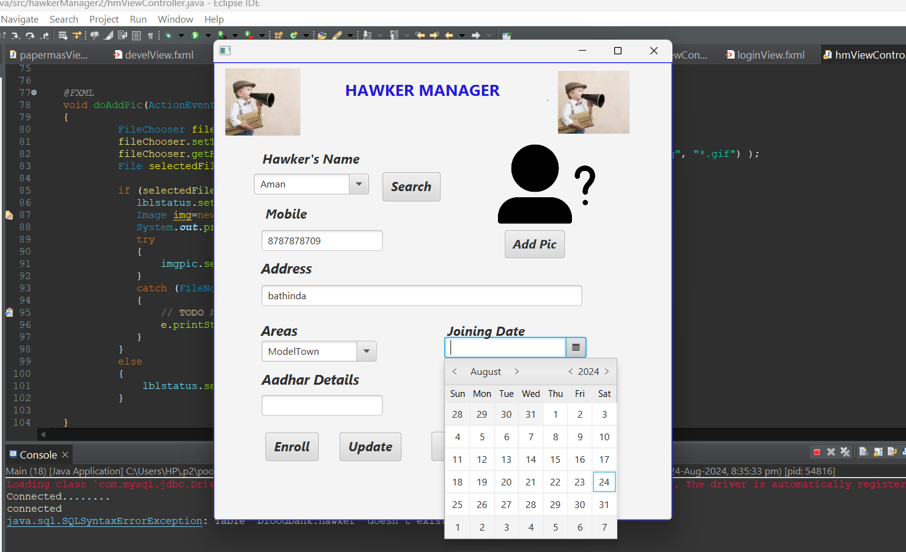

## Hawker Manager

The **Hawker Manager** feature allows administrators to efficiently manage hawker registrations and updates within the Newspaper Automation System. This interface provides a comprehensive set of tools for adding new hawkers, updating their details, and managing their assigned areas.

Administrators can register new hawkers by filling out a straightforward form that collects essential information, such as name, contact details, and allocated area. Once registered, admins have the ability to update hawker information as needed, including changing their allocated areas and ensuring that all details are current.

Additionally, the Hawker Manager allows administrators to upload pictures of hawkers, providing a visual reference that can help enhance the system's database. If necessary, hawkers can be removed from the system using the fire option, ensuring that the records are kept accurate and up-to-date.

Overall, the Hawker Manager feature streamlines the management of hawker registrations, making it easier for administrators to oversee operations and maintain a reliable database.

### - [Continue the Journey...](Page4.md)
