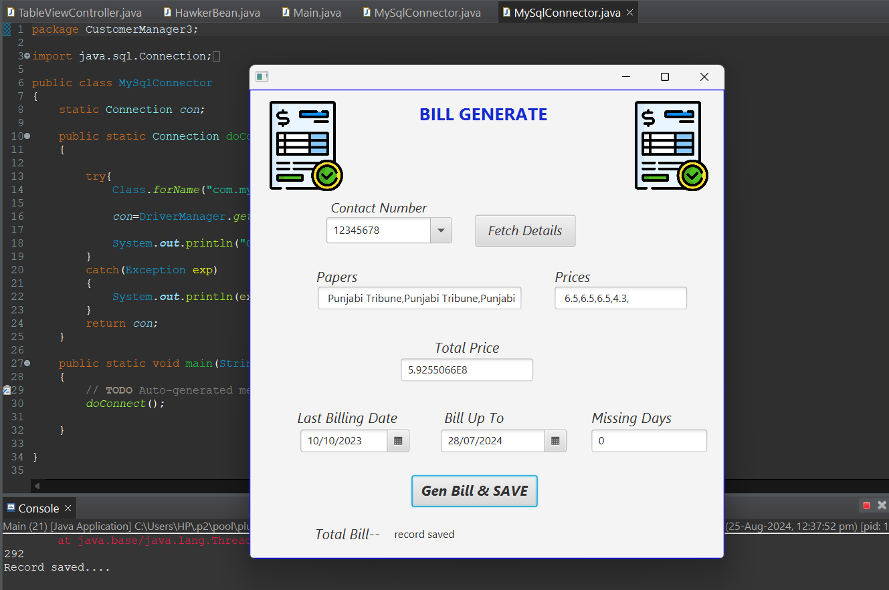

## Bill Generator

The Bill Generator allows users to efficiently create bills by following these steps:

1. **Mobile Number Input**: The user begins by entering a mobile number into the designated input field.
2. **Fetch Button**: After inputting the mobile number, clicking the "Fetch" button triggers the system to retrieve corresponding data from the SQL database. This includes details such as the paper price, the last billing date, and other relevant fields associated with that mobile number.
3. **Automatic Data Population**: Once the data is fetched, the system automatically fills in the fields with the retrieved information, saving time and ensuring accuracy.
4. **Missing Days Input**: The user can then specify the number of missing days in a text field.
5. **Date Selection**: Using the date picker, the user selects the "Date Up To" field, indicating the billing period's end date.
6. **Generate Bill**: Finally, the user clicks the "Generate Bill" button, which calculates and creates the bill based on the inputted data and the retrieved information.

This process ensures that all necessary details are accurately captured, allowing for quick and error-free bill generation.

### - [Continue the Journey...](Page5.md)