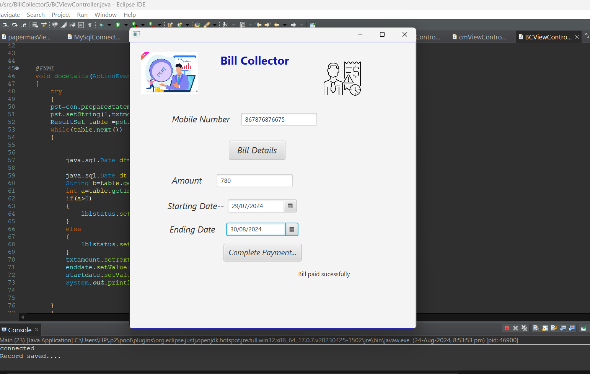

## Bill Collector

The **Bill Collector** feature is an essential component of the Newspaper Automation System that automates the billing process for customers. This feature allows administrators to generate accurate bills based on the registered mobile numbers of customers extracted from the database.

When using the Bill Collector, administrators can enter a customer's registered mobile number, which the system uses to retrieve their subscription details and history from the database. The bill is calculated according to the specified date range, enabling the generation of bills for specific periods (from start date to end date). This ensures that customers are billed accurately based on their subscription duration and the papers they have received.

Once the bill is generated, the customer can review the details, including the total amount due. To complete the payment process, customers simply click the **Complete Payment** button. This functionality streamlines the payment process, allowing for efficient transaction management and ensuring that customers can quickly settle their bills.

The Bill Collector enhances the overall efficiency of billing operations within the Newspaper Automation System, providing a reliable and user-friendly interface for managing customer payments. By automating the bill calculation and payment processes, this feature helps maintain accurate financial records and improves customer satisfaction.

### - [Continue the Journey...](Page6.md)
