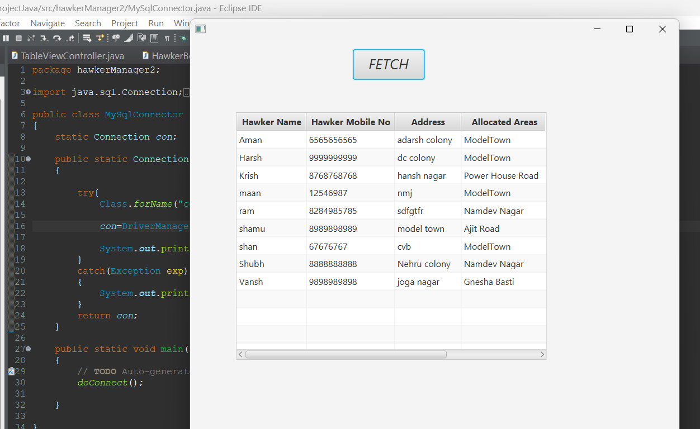

# Hawker Management System

## Description

The **Hawker Management System** is a Java-based application designed to manage and 
display the details of hawkers recorded in a MySQL database. This system allows users
 to fetch and view all the details of hawkers in a structured table format. 
<hr>

### Features

- **Data Fetching**: Retrieve and display hawker information from the database.
- **User Interface**: A user-friendly JavaFX interface that allows easy navigation
 and interaction.
- **Database Integration**: Connects to a MySQL database to store and manage hawker records.
- **Dynamic Table View**: Shows the hawker details including:
  - **Hawker Name**
  - **Mobile Number**
  - **Allocated Areas**
  - **Date of Joining**
<hr>
### How It Works

1. **Database Connection**: The application connects to a MySQL database using JDBC.
2. **Data Retrieval**: When the user clicks the "Fetch" button, the application executes a SQL query to fetch all hawker records.
3. **Table Display**: The retrieved data is displayed in a table format, making it easy to view and manage the information.
<hr>

### Usage

To use this application:

1. Set up a MySQL database and create a table named `hawker` with the following structure:
   ```sql
   CREATE TABLE hawker (
       hname VARCHAR(15) PRIMARY KEY,
       mobile VARCHAR(10),
       address VARCHAR(20),
       alloarea VARCHAR(20),
       picpath VARCHAR(500),
       doj DATE
   );
