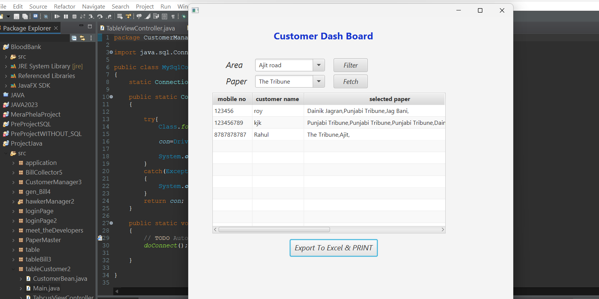

## Customer Dashboard

The **Customer Dashboard** provides a comprehensive view of hawkers based on the areas
 they serve and the specific products available. This feature allows users to easily 
 access and filter hawker information extracted from a MySQL database.

### Features

- **Area-Based Filtering**: Users can view hawkers based on their respective areas, ensuring easy access to local vendors.
- **Product Availability**: The dashboard displays hawkers and the specific products they offer, allowing customers to find exactly what they need.
- **Dynamic Data Retrieval**: Information is fetched in real-time from the MySQL database, ensuring that the data displayed is always up to date.
- **User-Friendly Interface**: The dashboard is designed for easy navigation, allowing users to quickly find hawkers according to their preferences.

### How It Works

1. **Database Connection**: The application connects to a MySQL database to retrieve hawker information.
2. **Data Extraction**: The relevant data is extracted based on user-selected criteria, such as area and product.
3. **Display Table**: The fetched data is displayed in a structured table format, showing all relevant details of each hawker.
4. **Fetch Button**: Users can click the "Fetch" button to refresh the data and see the latest information available.

This dashboard enhances user experience by simplifying the process of locating hawkers and their offerings, thus bridging the gap between customers and local vendors.

### - [Continue the Journey...](Page8.md)