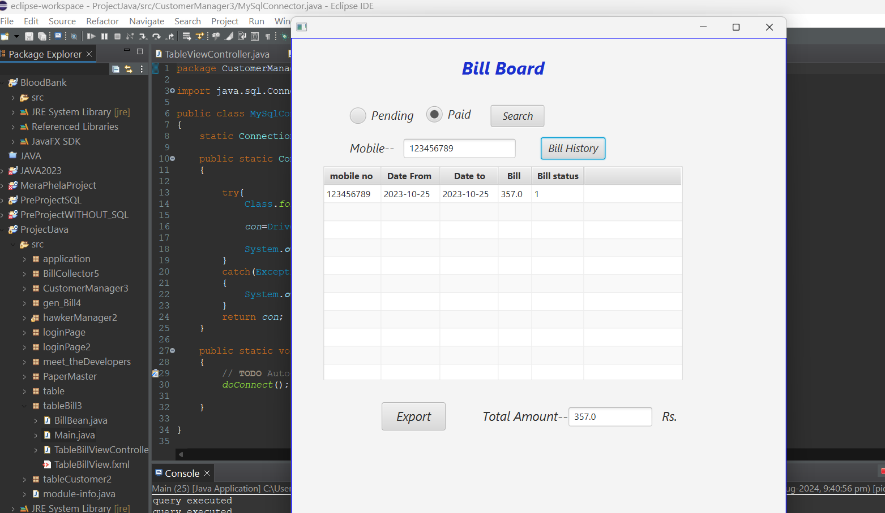

## Bill Board

The **Bill Board** feature allows users to easily access and manage their billing information. Users can check their bill details by utilizing a search functionality based on their mobile number, and filter the results according to payment status (Pending or Paid).

### Features

- **Search Functionality**: Users can enter their mobile number to retrieve their billing history quickly and efficiently.
- **Payment Status Filter**: The use of radio buttons allows users to filter their bills based on payment status, displaying only Pending or Paid bills.
- **Detailed Bill History**: Once the user submits their search, a table displays the relevant bill details, including date, amount, and payment status.
- **User-Friendly Interface**: The layout is designed for ease of use, enabling users to navigate and access their billing information without hassle.

### How It Works

1. **User Input**: Users enter their mobile number in the search field to initiate the search process.
2. **Payment Status Selection**: Users select either the Pending or Paid option using radio buttons to filter their results accordingly.
3. **Data Retrieval**: The application retrieves relevant billing history from the database based on the provided mobile number and selected payment status.
4. **Display Table**: The results are displayed in a structured table format, showing all pertinent details of the bills, making it easy for users to review their payment history.
5. **Bill Overview**: Users can view detailed information about each bill, including amounts due, payment dates, and current status.

This Bill Board feature enhances user experience by providing a straightforward way to manage and track billing information, ensuring that users can stay informed about their payment status effortlessly.

### - [Continue the Journey...](Page10.md)
