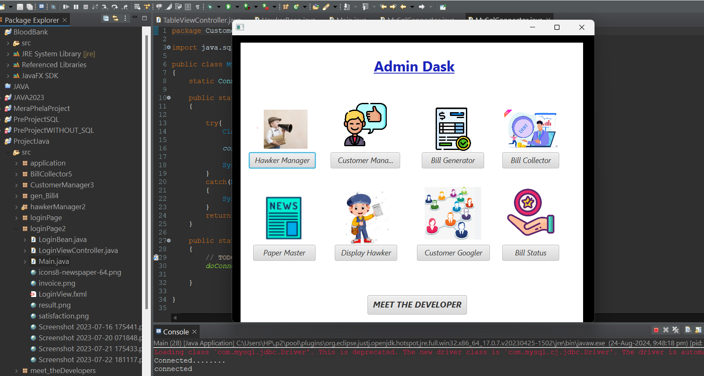

## Admin Desk

The **Admin Desk** feature is designed to provide administrators with a comprehensive and efficient management interface for overseeing the various functionalities of the application. Serving as a centralized hub, the Admin Desk allows administrators to easily access essential tasks and information. The layout is organized with a series of clearly labeled buttons, each representing a specific administrative function such as user management, report generation, settings updates, and data monitoring. This structured approach not only enhances navigability but also allows for quick interactions, enabling administrators to execute tasks with minimal effort. With the Admin Desk, administrative operations are streamlined, empowering users to maintain control over the system while ensuring that critical functions are just a click away.

### **[Login Page](Page1.md)**
### **[Paper Details](Page2.md)**
### **[Hawker Manager](Page3.md)**
### **[Customer Manager](Page4.md)**
### **[Bill Generator](Page4.5.md)**
### **[Bill Collector](Page5.md)**
### **[Hawker Manager Table](Page6.md)**
### **[Customer Table](Page7.md)**
### **[Bill Board](Page8.md)**
### **[Meet the Developers](Page10.md)**

### Features

- **Button Navigation**: A series of buttons are available on the Admin Desk, each representing a different administrative function, such as managing users, viewing reports, or updating settings.
- **Dialog Boxes**: Clicking on any button opens a corresponding dialog box, allowing admins to perform tasks or view information without navigating away from the main page.
- **User-Friendly Interface**: The design is intuitive, enabling administrators to access essential functions quickly and efficiently.

### How It Works

1. **Button Interaction**: Administrators can click on any of the buttons displayed on the Admin Desk.
2. **Dialog Box Display**: Upon clicking a button, a dialog box appears, presenting the relevant options or information related to the selected function.
3. **Task Management**: Within the dialog box, administrators can perform tasks, view details, or make changes as needed, providing a seamless management experience.
4. **Close Dialog**: Administrators can easily close the dialog box to return to the main Admin Desk view, maintaining a smooth workflow.

This Admin Desk feature streamlines administrative operations by consolidating essential functions into one accessible location, enhancing productivity and efficiency for administrators.

**[Customer Manager](Page2.md)**