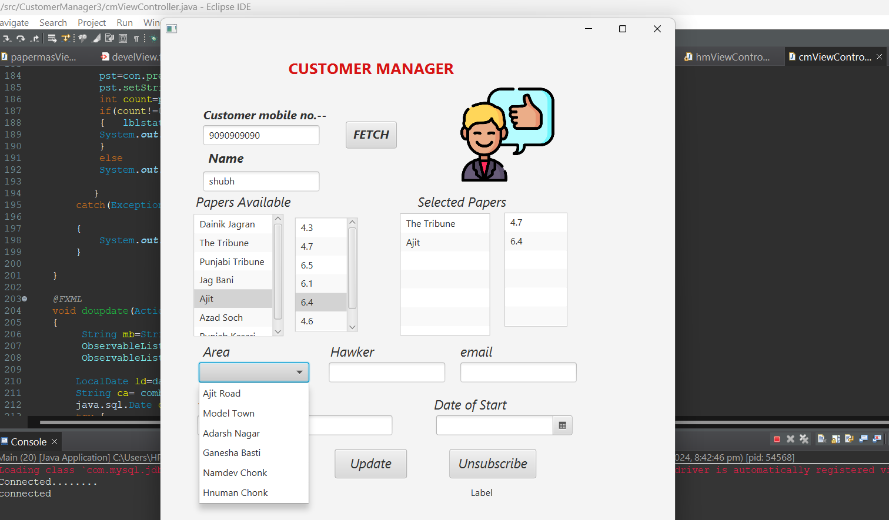

## Customer Manager

The **Customer Manager** feature provides administrators with the tools to efficiently manage customer information and interactions within the Newspaper Automation System. This interface allows for comprehensive oversight of customer profiles, ensuring that all relevant details are accurately recorded and easily accessible.

Administrators can add new customers by filling out a simple registration form that includes essential information such as name, contact details, and subscription preferences. This feature enables quick updates to customer profiles, allowing admins to modify information as needed, such as changing subscription plans or updating contact information.

In addition, the Customer Manager includes functionalities for tracking customer interactions and managing subscription status. Admins can view a list of all customers, search for specific profiles, and generate reports on customer activity. This holistic approach ensures that customer relationships are effectively managed, enhancing overall satisfaction and engagement with the newspaper services.

Overall, the Customer Manager feature streamlines customer management processes, making it easier for administrators to maintain a detailed and organized database of customer information.
